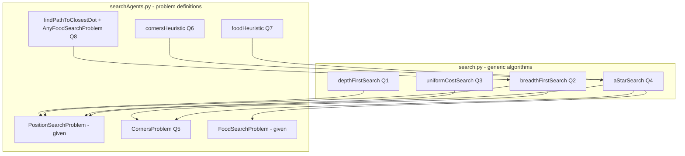
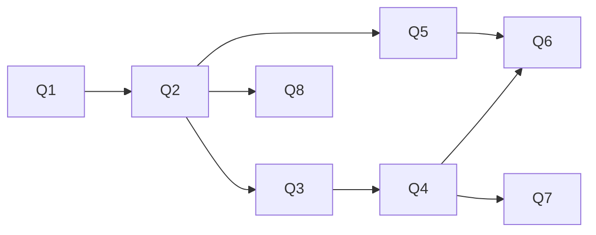

# Project 1: Search — Plan to Completion

This document explains the 8 problems in Project 1, where each one is solved in
the code, and gives you a ready-to-use prompt for each so you can ask me to help
you solve them one at a time.

The whole project only requires editing **two files**:

- `search.py` — the generic search algorithms (Q1–Q4)
- `searchAgents.py` — the Pacman-specific search problems and heuristics (Q5–Q8)

Do not edit any other file. The autograder relies on the exact names of the
functions and classes already present.

---

## How everything fits together (big picture)

Key idea: a **search problem** (in `searchAgents.py`) only knows about states,
goals, successors, and costs. A **search algorithm** (in `search.py`) is
generic: it asks the problem `getStartState()`, `isGoalState(s)`, and
`getSuccessors(s)`, and returns a list of actions (e.g. `['North', 'West', ...]`).

Every algorithm must return **a list of legal actions from start to goal**.

### The contract every search problem exposes

These are the only methods your algorithms should call:

- `problem.getStartState()` -> the start state (format depends on the problem)
- `problem.isGoalState(state)` -> `True`/`False`
- `problem.getSuccessors(state)` -> list of `(successor, action, stepCost)` triples

### Data structures you MUST use (from `util.py`)

The assignment requires these so the autograder gets predictable tie-breaking:

- `util.Stack` — LIFO, for DFS
- `util.Queue` — FIFO, for BFS
- `util.PriorityQueue` — min-heap, for UCS and A* (use `.push(item, priority)`)

---

## The general graph-search pattern

Q1–Q4 are nearly identical. They differ only in how the frontier (fringe) is
ordered. The shared skeleton is:

1. Put the start node on the frontier. A "node" must carry both the **state**
   and the **path of actions** taken to reach it (and cost for UCS/A*).
2. Pop a node from the frontier.
3. If its state is the goal, return the path.
4. If the state was already visited, skip it (this is the "graph search" part).
5. Otherwise mark it visited and push each successor with the extended path.
6. Repeat until the frontier is empty (return `[]` if no solution).

The only difference per algorithm:

| Q  | Algorithm | Frontier              | Priority used                  |
|----|-----------|-----------------------|--------------------------------|
| Q1 | DFS       | `Stack`               | none (LIFO)                    |
| Q2 | BFS       | `Queue`               | none (FIFO)                    |
| Q3 | UCS       | `PriorityQueue`       | cumulative cost `g`            |
| Q4 | A*        | `PriorityQueue`       | `g + heuristic(state, problem)`|

---

## Problem-by-problem requirements

### Q1 (3 pts) — Depth First Search

- **File / function:** `search.py` -> `depthFirstSearch(problem)` (line ~75)
- **Goal:** Graph-search DFS that never re-expands a visited state.
- **Frontier:** `util.Stack`.
- **Acceptance checks:**
  - `python pacman.py -l tinyMaze -p SearchAgent`
  - `python pacman.py -l mediumMaze -p SearchAgent` (solution length should be **130**)
  - `python pacman.py -l bigMaze -z .5 -p SearchAgent`
  - `python autograder.py -q q1`

### Q2 (3 pts) — Breadth First Search

- **File / function:** `search.py` -> `breadthFirstSearch(problem)` (line ~92)
- **Goal:** Graph-search BFS (finds a fewest-actions path).
- **Frontier:** `util.Queue`. Mark states visited **when you push them** to avoid
  enqueuing duplicates.
- **Acceptance checks:**
  - `python pacman.py -l mediumMaze -p SearchAgent -a fn=bfs`
  - `python pacman.py -l bigMaze -p SearchAgent -a fn=bfs -z .5`
  - `python autograder.py -q q2`
  - Bonus sanity check: `python eightpuzzle.py` should work unchanged.

### Q3 (3 pts) — Uniform Cost Search

- **File / function:** `search.py` -> `uniformCostSearch(problem)` (line ~97)
- **Goal:** Expand the node with the lowest cumulative cost `g` first.
- **Frontier:** `util.PriorityQueue`, priority = total path cost so far.
- **Acceptance checks:**
  - `python pacman.py -l mediumMaze -p SearchAgent -a fn=ucs`
  - `python pacman.py -l mediumDottedMaze -p StayEastSearchAgent`
  - `python pacman.py -l mediumScaryMaze -p StayWestSearchAgent`
  - `python autograder.py -q q3`

### Q4 (3 pts) — A* Search

- **File / function:** `search.py` -> `aStarSearch(problem, heuristic=nullHeuristic)` (line ~109)
- **Goal:** Like UCS, but priority = `g + heuristic(state, problem)`.
- **Frontier:** `util.PriorityQueue`.
- **Acceptance checks:**
  - `python pacman.py -l bigMaze -z .5 -p SearchAgent -a fn=astar,heuristic=manhattanHeuristic`
    (about ~549 nodes expanded)
  - `python autograder.py -q q4`

> After Q4, a clean design has all four algorithms sharing one helper. That's
> optional but recommended.

### Q5 (3 pts) — Corners Problem (state representation)

- **File / class:** `searchAgents.py` -> `CornersProblem` (line ~273)
- **Functions to fill in:**
  - `getStartState` (line ~293)
  - `isGoalState` (line ~301)
  - `getSuccessors` (line ~308)
- **Goal:** Define an abstract state that captures Pacman's position **and which
  corners have already been visited** (e.g. `(position, (bool, bool, bool, bool))`
  or `(position, frozenset_of_visited_corners)`).
- **Constraints:**
  - Do NOT store a full `GameState`; only the position + visited-corners info.
  - Each successor has cost 1.
  - States must be independent/immutable (use tuples/frozensets, not mutable
    shared objects).
- **Acceptance checks:**
  - `python pacman.py -l tinyCorners -p SearchAgent -a fn=bfs,prob=CornersProblem` (28-step path)
  - `python pacman.py -l mediumCorners -p SearchAgent -a fn=bfs,prob=CornersProblem`
  - `python autograder.py -q q5`

### Q6 (3 pts) — Corners Problem (heuristic)

- **File / function:** `searchAgents.py` -> `cornersHeuristic(state, problem)` (line ~347)
- **Goal:** A non-trivial, **consistent**, admissible heuristic for `CornersProblem`.
- **Idea that works:** From the current position, repeatedly take the Manhattan
  (or maze) distance to the nearest *unvisited* corner, then chain to the next
  nearest unvisited corner, summing as you go. Returns 0 at the goal.
- **Grading (nodes expanded):** `<=2000` = 1/3, `<=1600` = 2/3, `<=1200` = 3/3.
  Inconsistent heuristic = 0.
- **Acceptance checks:**
  - `python pacman.py -l mediumCorners -p AStarCornersAgent -z 0.5`
  - `python autograder.py -q q6`

### Q7 (4 pts) — Food Heuristic (eat all dots)

- **File / function:** `searchAgents.py` -> `foodHeuristic(state, problem)` (line ~428)
- **Goal:** Consistent heuristic for `FoodSearchProblem`. State is
  `(pacmanPosition, foodGrid)`; use `foodGrid.asList()` for food coordinates.
- **Idea that works:** The **maximum** maze distance from Pacman to any remaining
  food dot is admissible and consistent (use the provided `mazeDistance` helper,
  and cache results in `problem.heuristicInfo`). Returns 0 when no food remains.
- **Grading (nodes expanded):** `<=15000` = 2/4, `<=12000` = 3/4, `<=9000` = 4/4,
  `<=7000` = extra credit. Inconsistent = 0.
- **Acceptance checks:**
  - `python pacman.py -l testSearch -p AStarFoodSearchAgent` (cost 7)
  - `python pacman.py -l trickySearch -p AStarFoodSearchAgent`
  - `python autograder.py -q q7`

### Q8 (3 pts) — Suboptimal (closest-dot) Search

- **File:** `searchAgents.py`
- **Functions to fill in:**
  - `AnyFoodSearchProblem.isGoalState` (line ~517) — goal = current cell has food.
  - `ClosestDotSearchAgent.findPathToClosestDot` (line ~477) — build an
    `AnyFoodSearchProblem` and run BFS (`search.bfs(problem)`) on it.
- **Goal:** Greedily walk to the nearest dot repeatedly. Short solution expected.
- **Acceptance checks:**
  - `python pacman.py -l bigSearch -p ClosestDotSearchAgent -z .5` (cost ~350)
  - `python autograder.py -q q8`

---

## Recommended order

Do them in numeric order — later questions depend on earlier ones:

- Q5 builds on Q2 (BFS).
- Q6 builds on Q4 (A*).
- Q7 builds on Q4 (A*).
- Q8 builds on Q2 (BFS).

Run the full autograder at the end with `python autograder.py`.

> Reminder: run everything inside your conda env: `conda activate cs6364` first,
> then `python autograder.py -q qN`.

---

## Copy-paste prompts (ask me one at a time)

Each prompt is self-contained. Paste it to me when you're ready to work on that
question, and I'll implement it and verify with the autograder.

**Q1 — DFS**
> Implement `depthFirstSearch` in `search.py` as a graph search using `util.Stack`.
> Track the path of actions per node and skip already-visited states. Then run
> `python autograder.py -q q1` and confirm `mediumMaze` gives a 130-step path.

**Q2 — BFS**
> Implement `breadthFirstSearch` in `search.py` as a graph search using
> `util.Queue`, marking states visited as they're pushed. Run
> `python autograder.py -q q2` to confirm it passes.

**Q3 — UCS**
> Implement `uniformCostSearch` in `search.py` using `util.PriorityQueue` with
> cumulative path cost as the priority, handling cheaper re-discoveries of a
> state correctly. Run `python autograder.py -q q3`.

**Q4 — A***
> Implement `aStarSearch(problem, heuristic)` in `search.py` using
> `util.PriorityQueue` with priority `g + heuristic(state, problem)`. Run
> `python autograder.py -q q4` and check it on bigMaze with manhattanHeuristic.

**Q5 — Corners Problem**
> Implement `getStartState`, `isGoalState`, and `getSuccessors` in
> `CornersProblem` in `searchAgents.py`. Use an abstract state of
> (position, visited-corners) with cost-1 successors and no full GameState. Run
> `python autograder.py -q q5` and verify tinyCorners solves in 28 steps.

**Q6 — Corners Heuristic**
> Implement a consistent, admissible `cornersHeuristic` in `searchAgents.py`
> (e.g. greedy nearest-unvisited-corner chaining of Manhattan distances). Run
> `python autograder.py -q q6` and report nodes expanded (aim for <=1200).

**Q7 — Food Heuristic**
> Implement a consistent `foodHeuristic` in `searchAgents.py` using the max maze
> distance to any remaining food (cache via problem.heuristicInfo). Run
> `python autograder.py -q q7` and report nodes expanded (aim for <=9000).

**Q8 — Closest-Dot Search**
> Implement `AnyFoodSearchProblem.isGoalState` and
> `ClosestDotSearchAgent.findPathToClosestDot` in `searchAgents.py` using BFS.
> Run `python autograder.py -q q8` and verify bigSearch solves with cost ~350.

**Final check**
> Run the full `python autograder.py` and summarize my total score across all 8
> questions.
